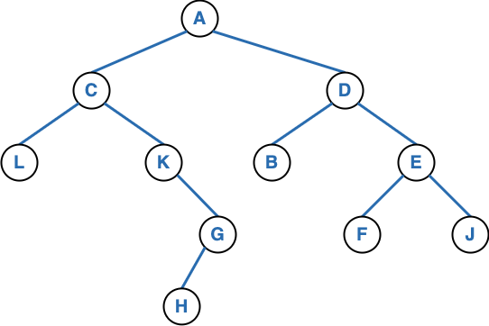

## Aufgabenblatt 6 - Bäume
## Aufgabe 1: Knotenfolgen
1. Geben Sie die Knoten des folgenden Binärbaumes in Preorder, Inorder und Postorder aus.

   

3. Gegeben seien zu **einem** allgemeinen Baum die folgenden Knotenreihenfolgen:

   - Preorder: **e b a d c f h g**
   - Postorder: **a b c f h d g e**

   1. Konstruieren Sie hieraus den Baum und zeichnen ihn auf. Beschreiben Sie, wie Sie vorgegangen sind.
   1. Geben Sie die Knoten des Baumes in Inorder aus.

## Aufgabe 2: Implementierung von Knotenfolgen
Implementieren Sie die Methoden ```preorder()```, ```postorder()``` und ```inorder()``` im Interface
[BinaryTree](../src/main/java/de/hs_el/streekmann/algodat/aufgabe6/BinaryTree.java). Die Implementierungen müssen die
Tests in [BinaryTreeTest](../src/test/java/de/hs_el/streekmann/algodat/aufgabe6/BinaryTreeTest.java) erfüllen.
Hinweis: Sie können die Methoden implementieren, in dem Sie die anderen Methoden des Interfaces nutzen. Sie können
außerdem weitere (ggf. rekursiv aufzurufenden) default-Methoden hinzufügen.

## Aufgabe 3: Huffman-Code - Beispiele
Bestimmen Sie zu den folgenden Symbolen und ihren Häufigkeiten jeweils den Huffman-Code, zeichnen Sie den Baum und geben
Sie die mittlere Codelänge an.

1.

|   Symbol   |  A  |  B  |  C  |  D  |  E  |  F  |  G  |
|:----------:|:---:|:---:|:---:|:---:|:---:|:---:|:---:|
| Häufigkeit | 10  | 10  | 15  | 15  | 15  | 15  | 20  |

2.

|   Symbol   | Hund | Katze | Maus | Delfin | Giraffe | Affe | Elefant |
|:----------:|:----:|:-----:|:----:|:------:|:-------:|:----:|:-------:|
| Häufigkeit |  35  |  30   |  5   |   1    |    1    |  2   |    1    |
3.

|   Symbol   | Mini | Astra | Golf | Z4  | Uno | Leon | X5  |
|:----------:|:----:|:-----:|:----:|:---:|:---:|:----:|:---:|
| Häufigkeit |  5   |  30   |  50  |  5  |  5  |  15  |  5  |

## Aufgabe 4: Huffman-Code - Aufwandsanalyse
Betrachten Sie den folgenden Pseudo-Code zur Erstellung eines Baumes zum Huffman-Code für eine Liste von Symbolen und
ihren Häufigkeiten.   
Benötigte Daten: baumSammlung eine (initial leere) Sammlung von Bäumen

Ablauf in Pseudocode:

```
Für alle Symbole sym
   Erzeuge einen Binärbaum b mit dem Symbol sym als Knoten  
   Füge b in baumSammlung ein
   
Solange (baumSammlung.length > 1)
  Wähle die beiden Bäume b0 und b1 mit den kleinsten Häufigkeiten aus  
  Entferne b0 und b1 aus der baumSammlung
  Erzeuge aus b0 und b1 einen neuen Baum b mit der Summe der Häufigkeiten von b0 und b1  
  Füge b in baumSammlung ein
```

Wie wählen Sie die beiden Bäume mit den kleinsten Häufigkeiten aus? Nennen Sie mindestens drei Möglichkeiten
(unterschiedliche Datenstrukturen für baumSammlung und Vorgehensweisen für die Auswahl) und vergleichen Sie die Aufwände
der gefundenen Möglichkeiten. Geben Sie für jede der Möglichkeiten den Aufwand des gesamten Ablaufs in O-Notation an.
